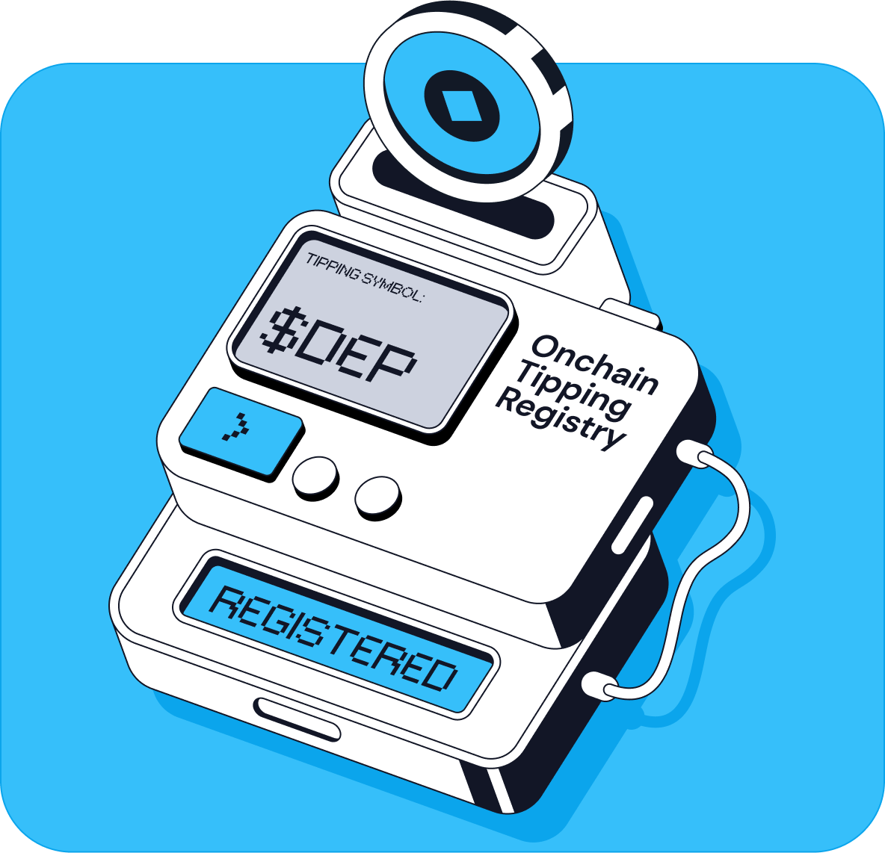

# Onchain Tipping Registry



OTR allows you to register and create tipping coins for any existing ERC20 token on Ham chain. <a href="https://docs.ham.fun">Documentation</a>.

See [DeployTippy.s.sol](./script/DeployTippy.s.sol) for a full example of creating an ERC20 token, registering a tipping symbol, and converting the ERC20 into the corresponding tippable coin.

## Prerequisites

1. Install [Foundry](https://book.getfoundry.sh/getting-started/installation)
2. Install [Bun](https://bun.sh/docs/installation) (if you want to run the Typescript file to generate the tipping symbol hash)
3. Install submodules

```
git submodule update --init --recursive
```

4. Install bun dependencies

```
bun install
```

## Running the scripts

Included is a shell script you can run to deploy an ERC20 token, register a tipping coin, and convert a portion of the original token into the tippable version.

You can modify the [DeployTippy.s.sol](./script/DeployTippy.s.sol) file to include the tipping symbol you'd like to use and the [Tippy.sol](./src/mock/Tippy.sol) ERC20 to modify the original ERC20 contract.

1. First copy the example env file and add the private key you'd like to use.

```
cp .env.example .env
```

2. You can get your tipping symbol by running the [getSymbolHash.ts](./ts/getSymbolHash.ts) script. Modify the script to include the tipping symbol you'd like to register.

```
bun run ./ts/getSymbolHash.ts
```

3. Replace the `sym` variable in [DeployTippy.s.sol](./script/DeployTippy.s.sol) with the hash of your tipping symbol.

4. Run the deploy script. You can remove the --broadcast flag from [deploy-tipping-coin.sh](./cli/deploy-tipping-coin.sh) to simulate running the transaction.

**‼️ The cost to register a tipping symbol is 250,000 $TN100x. You will need 250,000 $TN100x on Ham chain in the wallet submitting the transaction to register the tipping symbol.**

[TN100x on Base](https://basescan.org/address/0x5b5dee44552546ecea05edea01dcd7be7aa6144a)

[TN100x on Ham](https://explorer.ham.fun/token/0xE8DD44d0791B73afe9066C3A77721f42d0844bEB)

[Bridge](https://ham.fun/bridge)

```
./cli/deply-otr.sh
```

## Running tests

You must install Foundry before running tests.

```
forge test --fork-url https://rpc.ham.fun --match-path ./test/Otr.t.sol -vvv
```
